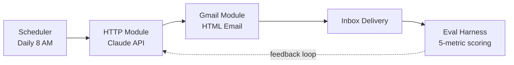

# Daily AI Digest System

An autonomous AI competitive intelligence system that scans the AI ecosystem every morning and delivers a structured, opinionated digest to your inbox at 8 AM, with a built-in evaluation harness that scores its own output across five metrics.

**Status:** Live · **Schedule:** Daily at 8 AM · **Sources scanned:** 30+ · **License:** MIT

---

## What this does

Every morning at 8 AM, this system:

1. **Scans ~30 AI and tech sources** for relevant news from the last 24 hours
2. **Picks 4 stories** that matter, not the noisiest, the most signal-rich
3. **Writes a structured digest** with summary, "why it matters," and a concrete decision angle for each story
4. **Synthesizes a pattern** across the four stories. What does today's news mean as a whole?
5. **Suggests one 15-minute action** to take based on what you just read
6. **Delivers everything to your inbox** as a clean, scannable HTML email

It's a personal version of what a competitive intelligence team would produce, but automated, opinionated, and tuned to the things you actually care about.

---

## Why I built this

I read AI news every day for work. The problem isn't access to information. It's that most newsletters are noisy, generic, and force you to extract the signal yourself.

I wanted something that:

- Filters aggressively (4 stories, not 40)
- Tells me what to *do* with the information, not just what happened
- Connects today's news to a larger pattern
- Improves on its own output through measurable feedback

So I built it.

---

## Architecture



**Stack:**

- **Orchestration:** Make.com (no-code automation)
- **Generation:** Anthropic Claude API
- **Delivery:** Gmail API
- **Evaluation:** Python + LLM-as-judge

The whole thing runs without me touching it. I read the digest with morning coffee. The eval harness runs in the background and tells me when output quality drifts.

---

## Sample Output

A real digest from the system, rendered in Gmail:

sample: https://claude.ai/public/artifacts/94c9624e-65dd-489f-8ba2-32fbd2373e0a

The output is structured into:

- **What Happened Today.** 4 numbered stories, each with summary, "why it matters," and a concrete decision angle
- **The Pattern.** What these four stories mean together
- **Your Action for Today.** One 15-minute exercise to lock in the learning
- **Go Deeper.** Links to dig further
- **Quick Check.** One MCQ to test that you actually retained it
- **Rate this Digest.** Feedback that flows back into the eval harness

---

## The Evaluation Harness

This is the part I'm most excited about.

The digest is generated by an LLM, which means it can drift, hallucinate, repeat itself, or produce generic output. Without measurement, you don't know if today's digest is better or worse than last week's. So I built an eval harness that scores every digest across five metrics.

### The 5 metrics

| Metric | Weight | What it measures | How it's scored |
|---|---|---|---|
| **Factual Accuracy** | 30% | Is the digest factually correct against source URLs? | LLM-as-judge against fetched sources, capped at 0.5 if no source URL provided |
| **Recency** | 20% | How fresh is the news? | Pure Python: 1.0 if 24h or less, 0.5 if 72h or less, 0.0 if older |
| **Relevance** | 20% | Does the content match the user profile and interests? | LLM-as-judge against a stored user profile |
| **Actionability** | 20% | Is each "PM Insight" specific and actionable, or a generic platitude? | LLM-as-judge, 1.0 = concrete behavior change, 0.0 = vague |
| **Coverage** | 10% | What high-signal news did the digest miss? | LLM judges what should have been included but wasn't |

### Why these five

- **Factual accuracy** is the floor. If the digest is wrong, nothing else matters.
- **Recency** prevents the system from recycling old news.
- **Relevance** keeps it tuned to my actual interests, not generic AI news.
- **Actionability** is the hardest one. It's the difference between "interesting" and "useful."
- **Coverage** catches blind spots the system has.

### What the harness does for me

After each run, the harness:

1. Calculates a **composite score (0 to 10)** for the day's digest
2. **Surfaces the single weakest metric.** For example, "Actionability dropped to 0.55, the PM Insights are getting generic"
3. Suggests **one specific fix** for tomorrow's prompt. For example, "Require one concrete behavior change per insight"

This is the feedback loop that makes the system better over time, not just consistent.

[`src/eval_harness.py`](./src/eval_harness.py)

---

## Setup

> This repo documents the system and ships the eval harness. The Make.com scenario itself is private (it contains my API keys and personal preferences), but everything you'd need to rebuild it is here.

### What you need

- A Make.com account (free tier works)
- An Anthropic API key
- A Gmail account
- Python 3.9+ (for the eval harness only)

### High-level steps

1. **Create a Make.com scenario** with three modules: Scheduler, HTTP, Gmail
2. **Configure the Scheduler** to run daily at 8 AM (or whenever you want)
3. **Configure the HTTP module** to call `https://api.anthropic.com/v1/messages` with your API key, the digest prompt as the system message, and your model of choice
4. **Configure Gmail** to send the HTML response to your own inbox
5. **Clone this repo** and run the eval harness against your digest

```bash
git clone https://github.com/kalpanalsr16-ctrl/daily-ai-digest-system.git
cd daily-ai-digest-system
pip install -r requirements.txt
export ANTHROPIC_API_KEY=your_key_here
python src/eval_harness.py
```

### The prompt

The system prompt that drives generation is intentionally not in this repo. It's been iterated on dozens of times and is tuned to my interests. But the structure is:

1. Define the user profile (interests, focus areas, gaps)
2. Define the source list to scan
3. Define the output schema (4 stories, synthesis, action, etc.)
4. Constrain the format (HTML only, specific structure)
5. Reference the eval rubric so the model knows what it's optimizing for

---

## Roadmap

- [x] Daily delivery
- [x] HTML formatting with semantic structure
- [x] 5-metric evaluation harness
- [x] LLM-as-judge scoring
- [ ] Auto-feedback loop. Eval scores update the prompt automatically.
- [ ] Weekly meta-report. What patterns emerged across 7 daily digests.
- [ ] User-side feedback integration. My reply ratings feed back into the eval.

---

## Tech notes

A few decisions worth flagging:

- **Why Make.com and not a custom Python script?** No-code orchestration means the scheduler, retry logic, error handling, and email delivery come free. The trade-off is less control over edge cases. For a personal tool, the trade is worth it.
- **Why LLM-as-judge for evaluation?** Most of the metrics (relevance, actionability, coverage) are inherently subjective. A rule-based scorer would be brittle. LLM-as-judge with explicit rubrics gives consistent scores across runs.
- **Why score the system at all?** Because you can't improve what you don't measure. Without the eval harness, I'd have a "vibes-based" sense of whether the digest is good. With it, I have numbers I can act on.

---

## License

MIT. Use, fork, modify freely.

---

*Built and maintained as a personal automation project. If you found this useful or want to chat about agent systems and evaluation pipelines, ping me on [LinkedIn](https://www.linkedin.com/in/kalpana-yadav-a5a77a131/).*
